# CIBEL (CIBer-angEL): Aplicación para la gestión de la seguridad y la sostenibilidad asociada al uso de dispositivos IoT

## Descripción
En un mundo cada vez más digitalizado, donde la seguridad y sostenibilidad de los dispositivos IoT son críticas, nace la aplicación CIBEL (CIBer-angEL). Con un enfoque centrado en las personas, CIBEL busca mejorar la ciberseguridad y sostenibilidad personal y familiar. Especialmente, pone énfasis en el Internet de las Cosas (IoT), que desempeña un papel esencial en nuestras vidas cotidianas, desde hogares inteligentes hasta entornos industriales.

## Funcionalidades
La aplicación se divide en do spestañas principales: Home y Perfil.

### Pestaña Home
En la pestaña Home, los usuarios tienen acceso a un catálogo de dispositivos organizadas por categorías, permitiéndoles explorar información detallada sobre cada uno. A simple vista, pueden visualizar una imagen, el nombre y la puntuación de seguridad y de sostenibilidad de los dispositivos IoT.

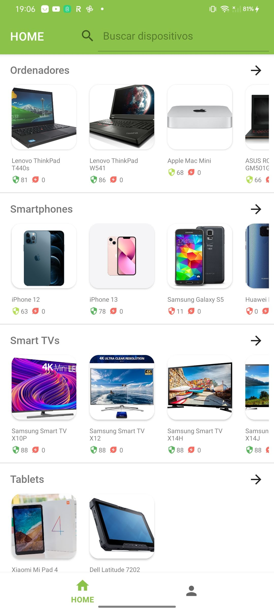

Al seleccionar una categoría, el usuario puede explorar una lista vertical más cómoda de dispositivos en dicha categoría, con la posibilidad de ordenarla según su puntuación de seguridad o sostenibilidad, ya sea de forma ascendente o descendente.

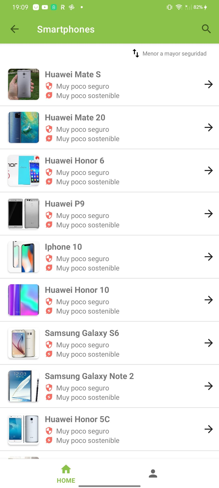
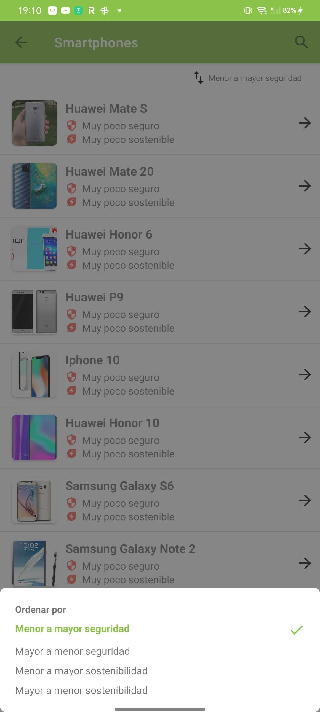

Asimismo, la aplicación ofrece un buscador que permite buscar dispositivos por nombre o categoría, y los resultados pueden ordenarse igualmente por puntuación de seguridad o sostenibilidad.

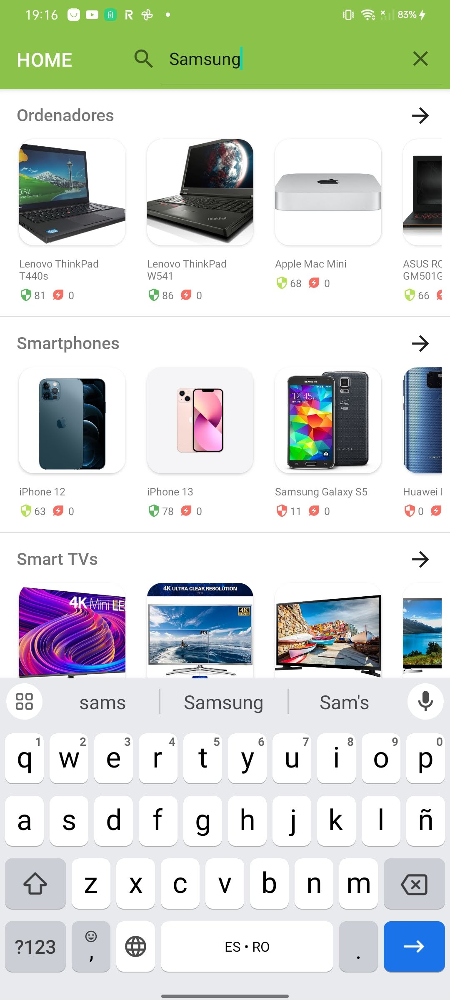
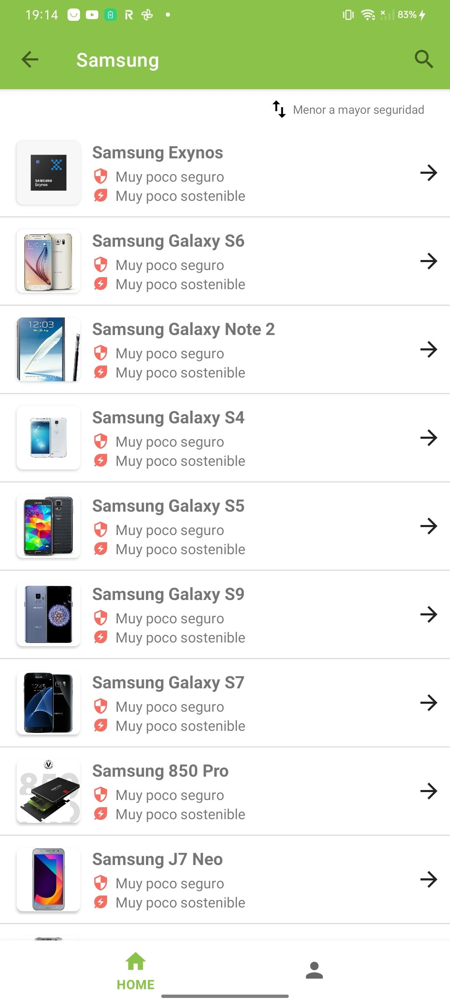

### Detalle de Dispositivo
Al seleccionar cualquier dispositivo, se despliega información detallada, que abarca su nombre, categoría, imagen, así como su puntuación tanto en seguridad como en sostenibilidad. 
A continuación, se presentan dos pestañas distintas: una denominada "Seguridad", donde se exhibe un gráfico que categoriza los fallos de seguridad según su gravedad, junto con una lista detallada que resume su impacto en confidencialidad, integridad y disponibilidad. Esta lista de fallos se puede ordenar por antigüedad o gravedad, ya sea de forma ascendente o descendente. La segunda pestaña, llamada "Sostenibilidad", ofrece un gráfico que ilustra la puntuación del dispositivo en aspectos clave como durabilidad, reparabilidad, reciclabilidad, eficiencia climática y uso eficiente de recursos.
Desde esta vista, los usuarios tienen la capacidad de agregar o eliminar dispositivos de su perfil. Al añadir un dispositivo un icono indicativo aparece en el catálogo para señalar su inclusión.

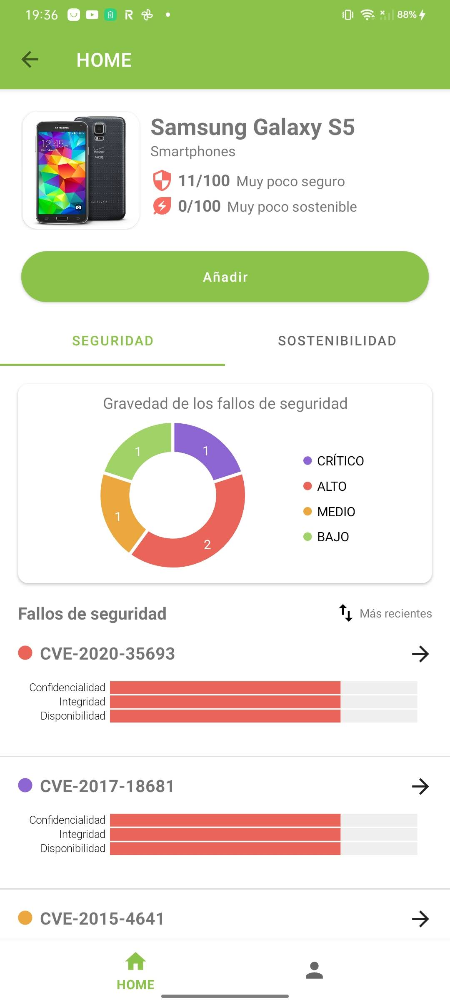
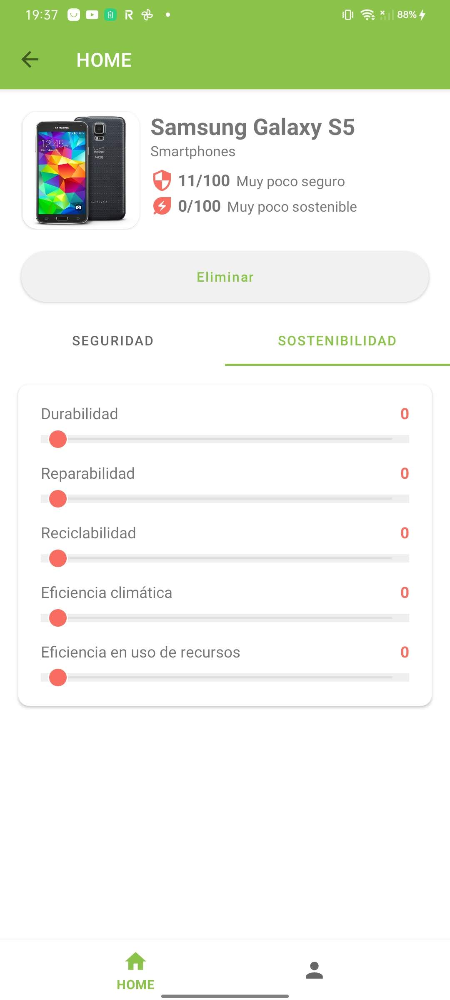
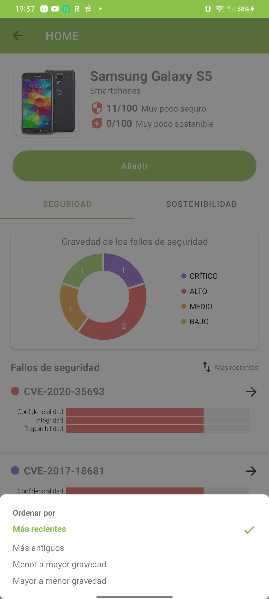
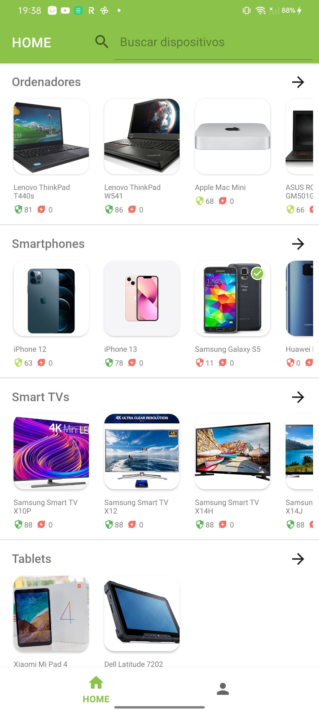

### Detalle de fallo de seguridad
Al seleccionar un fallo de seguridad o CVE (Common Vulnerabilities and Exposures), se presenta información detallada, incluyendo el identificador del CVE, descripción, gravedad e impacto en confidencialidad, integridad y disponibilidad. Para aquellos usuarios no familiarizados con estos conceptos, se proporciona un icono informativo.

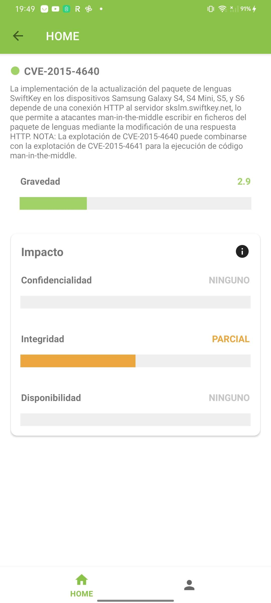
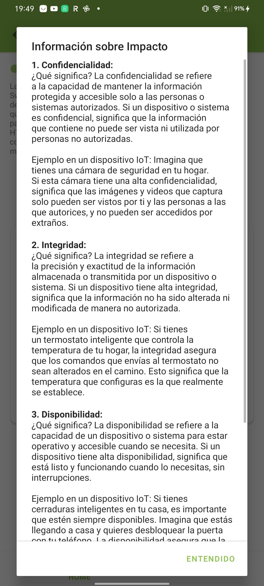

### Pestaña Perfil
En la pestaña de Perfil, se exhibe un gráfico que refleja la puntuación de seguridad y sostenibilidad global del usuario, basada en los dispositivos agregados al perfil. La lista de dispositivos incluidos se presenta para un control más detallado, permitiendo ordenarla por seguridad o sostenibilidad, ya sea de forma ascendente o descendente.

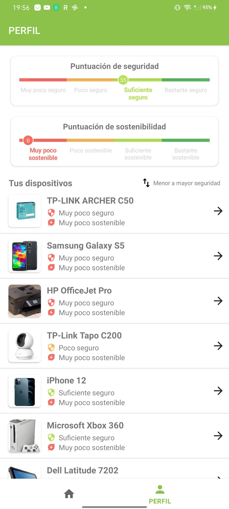
